# Database Security Assessment Using SQLMap (OWASP Juice Shop)

## Objective

To perform manual and automated SQL Injection testing against a web application authentication API using SQLMap in a controlled lab environment.

---

## Scope

* Target: (http://127.0.0.1:3000)
* Application: OWASP Juice Shop
* Environment: Local Docker Lab on Kali Linux
* Assessment Type: Web Application Database Security Testing

---

## Tools Used

* sqlmap
* Firefox Browser
* Browser Developer Tools
* Docker
* Kali Linux

---

## Methodology

The assessment followed a structured web application testing methodology:

1. Target setup and verification
2. Manual authentication testing
3. Browser request interception
4. JSON request analysis
5. SQL Injection testing using SQLMap
6. Backend DBMS fingerprinting
7. Analysis of application behavior and server responses

---

# Target Setup

Purpose:
To deploy and access the vulnerable web application in a local lab environment.

The OWASP Juice Shop application was hosted locally using Docker and accessed through the browser.

### Output

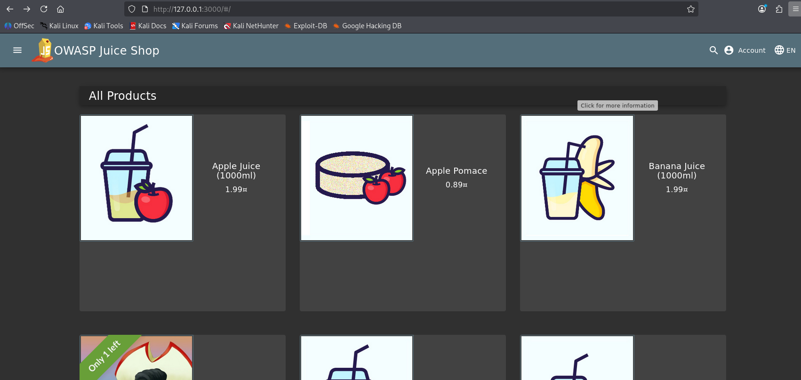

---

# Manual Input Testing

Purpose:
To manually test authentication input fields for abnormal application behavior and possible SQL Injection indicators.

Special characters such as single quotes were inserted into authentication fields to observe application responses and error handling behavior.

Test Payload Used
```
'
```
### Observed Behavior

The application generated abnormal responses during invalid input testing, indicating improper backend handling of user supplied data.

### Output
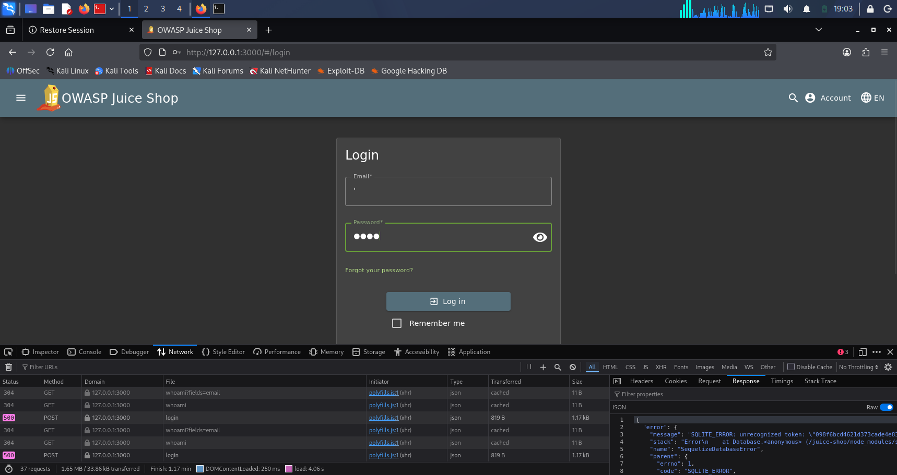

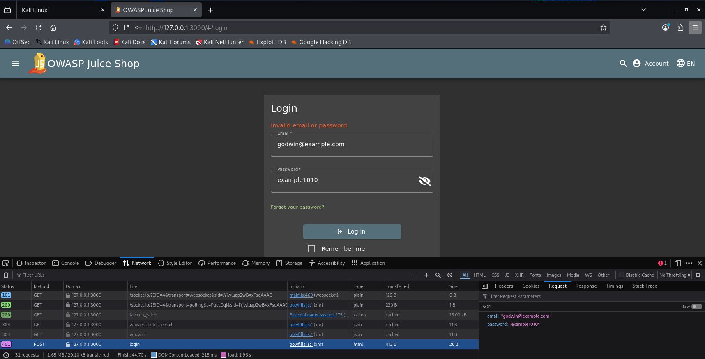

---

# Browser Network Request Analysis

Purpose:
To intercept and inspect authentication requests sent by the application backend API.

Firefox Developer Tools were used to monitor live network traffic generated during login operations.

### Output

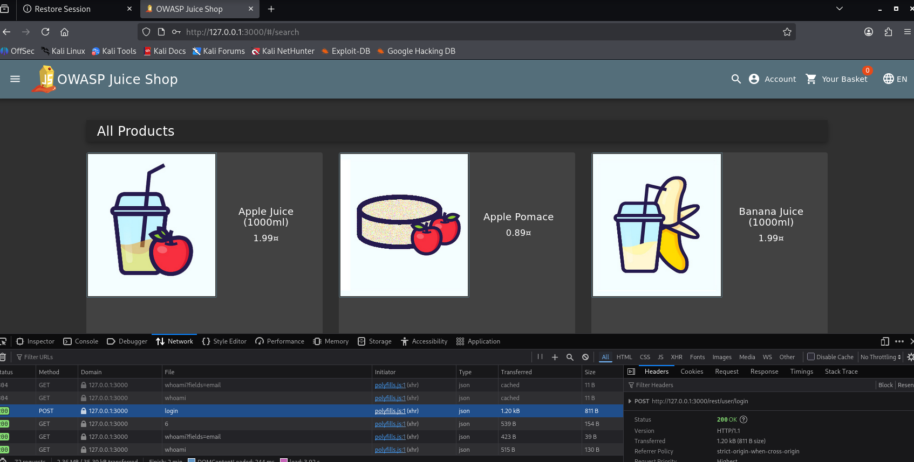

---

# JSON Request Capture

Purpose:
To identify request parameters and extract the authentication request for automated testing.

The captured login request contained JSON-formatted authentication parameters submitted to the backend API.

### Captured Request

```json id="’wini112"
{
  "email":"godwin@example.com",
  "password":"Example1010@"
}
```

### Output

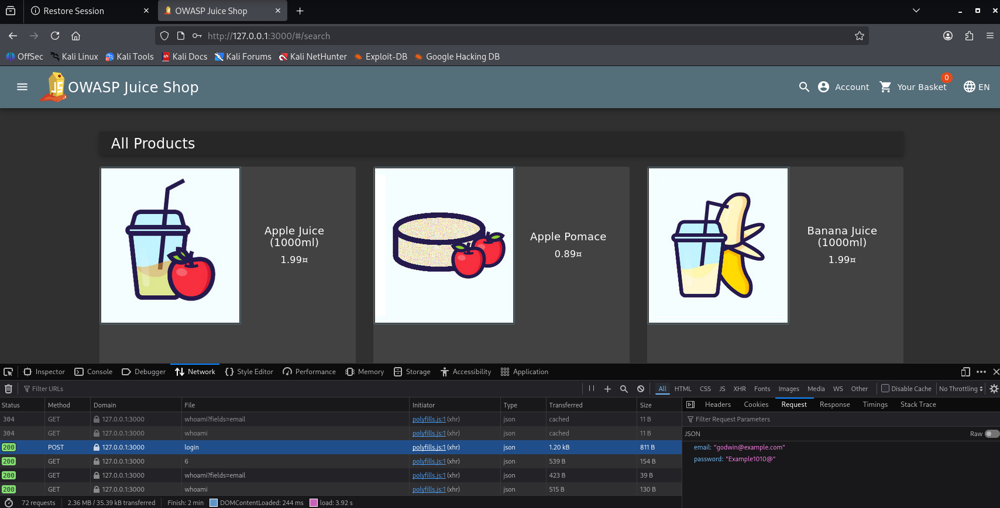

---

# SQLMap Request File Preparation

Purpose:
To prepare a reusable HTTP request file for SQL Injection testing.

The captured request was saved into a request file for SQLMap processing.

### Command Used

```bash id="’wini113"
nano request.txt
```

### Request File Content

```http id="’wini114"
POST /rest/user/login HTTP/1.1
Host: 127.0.0.1:3000
Content-Type: application/json

{"email":"godwin@example.com","password":"Example1010@"}
```

### Output

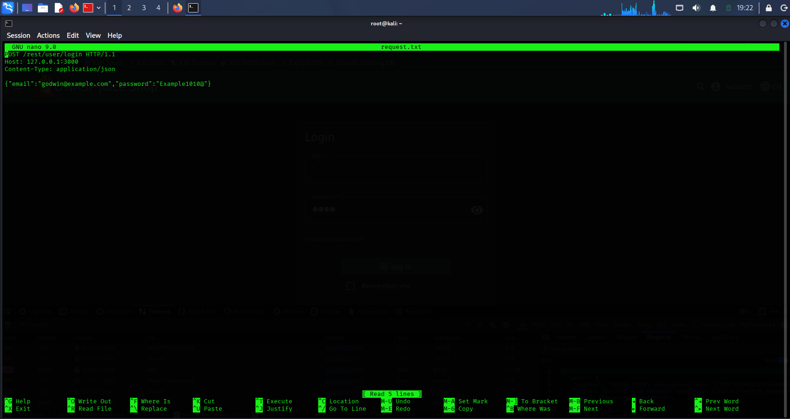

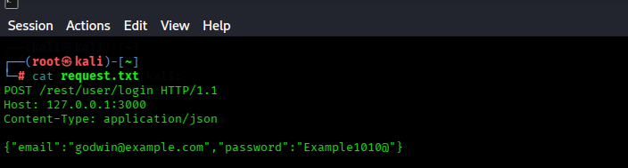

---

# Initial SQLMap Connection Testing

Purpose:
To verify communication between SQLMap and the target application.

SQLMap successfully parsed and processed the JSON authentication request.

### Command Used

```bash id="’wini115"
sqlmap -r request.txt --batch --ignore-code=401
```

### Output
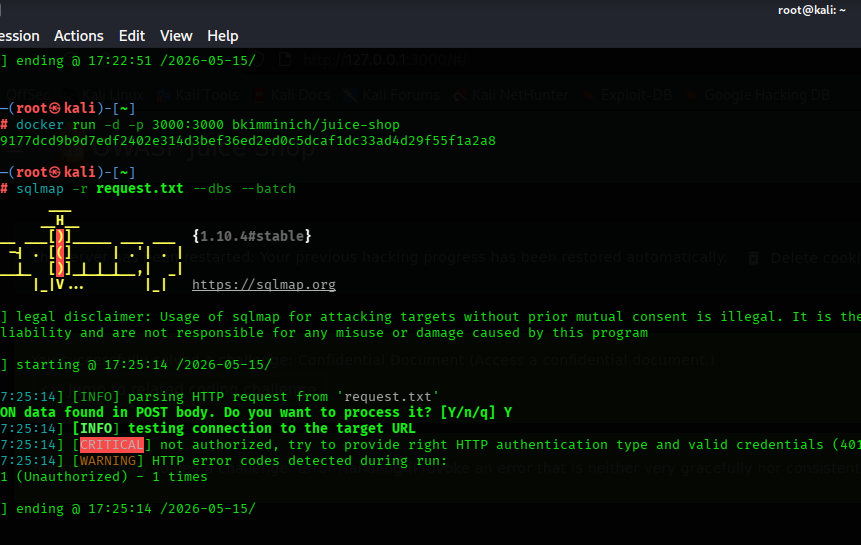

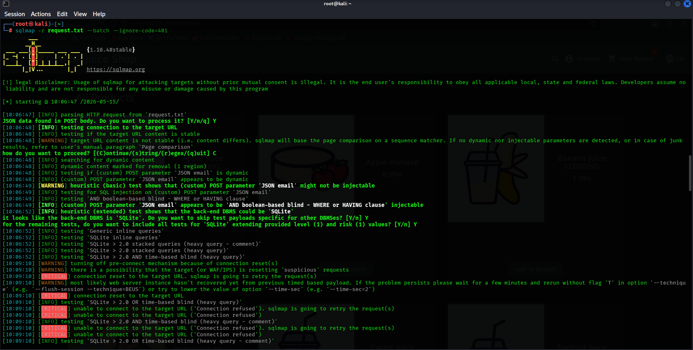

---

# SQL Injection Parameter Testing

Purpose:
To test authentication parameters for possible SQL Injection vulnerabilities.

SQLMap performed multiple injection techniques against the JSON email and password parameters.

### Output


---

# Boolean-Based SQL Injection Detection

Purpose:
To identify potential blind SQL Injection behavior.

SQLMap reported possible boolean-based SQL Injection indicators during testing of the email parameter.

### Observed Indicator

```plaintext id="’wini116"
(custom) POST parameter 'JSON email' appears to be 'AND boolean-based blind - WHERE or HAVING clause' injectable
```

### Output

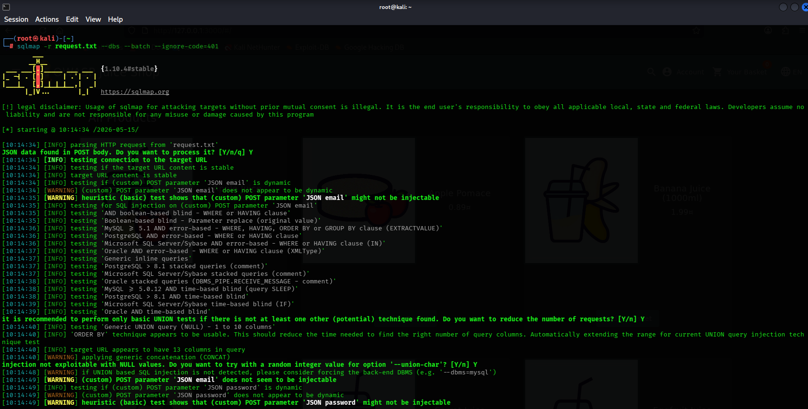


---

# Server Response & Stability Analysis

Purpose:
To observe how the application responded to advanced SQL Injection payloads.

During time-based and stacked query testing, the application generated multiple server-side errors and unstable responses.

### Observed Behaviors

* HTTP 401 Unauthorized responses
* HTTP 500 Internal Server Errors
* Connection resets during heavy query testing

### Output

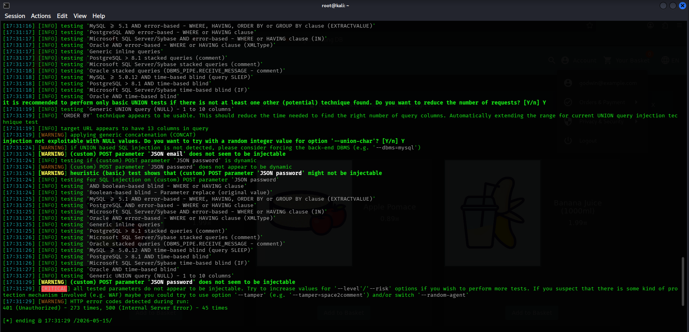

---

# 11. Final SQLMap Assessment Results

Purpose:
To evaluate the overall exploitability of tested parameters.

Although SQLMap detected possible SQL Injection indicators and backend database behavior, full database enumeration was not successfully achieved.

### Output

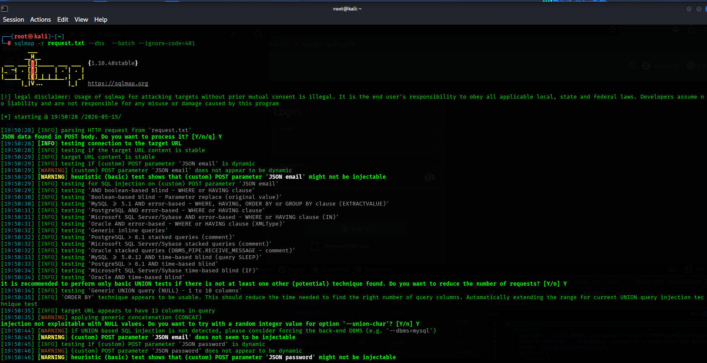

---

# Findings

* Authentication requests used JSON-based API communication
* Browser Developer Tools successfully captured backend requests
* SQLMap identified possible boolean-based SQL Injection behavior
* Backend database behavior suggested possible SQLite usage
* The application generated unstable responses during advanced payload execution
* Full database enumeration was not achieved during testing

---

# Risk Analysis

Potential SQL Injection vulnerabilities may allow attackers to:

* Manipulate backend database queries
* Bypass authentication mechanisms
* Access unauthorized data
* Trigger server instability
* Extract sensitive application information

---

# Mitigation

* Use parameterized database queries
* Implement strict server-side input validation
* Sanitize JSON request parameters
* Deploy proper authentication controls
* Implement Web Application Firewall (WAF) protections
* Conduct regular secure code reviews and penetration testing

---

# Conclusion

This lab demonstrates how SQLMap can be used to assess modern web applications utilizing JSON-based authentication APIs. The assessment included manual request analysis, automated SQL Injection testing, backend DBMS fingerprinting, and server response evaluation.

Although full database exploitation was not achieved, the assessment revealed indicators of possible SQL Injection behavior and highlighted the importance of secure input handling and API protection mechanisms in modern web applications.

---

# Disclaimer

All testing activities in this repository were performed in a controlled local lab environment using intentionally vulnerable applications for educational and ethical purposes only. Unauthorized testing against systems without proper authorization is illegal and unethical.
